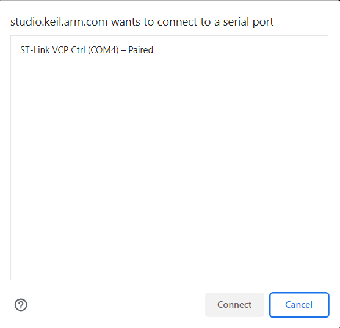
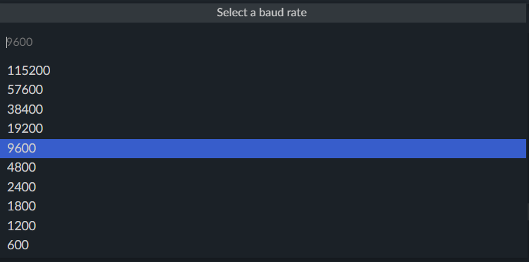
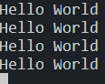

# Serial Output

# Contents
- [Serial Output](#serial-output)
- [Contents](#contents)
- [Introduction](#introduction)
- [Project](#project)
  - [Opening the Serial Monitor](#opening-the-serial-monitor)

# Introduction

This tutorial is aimed to show you how send data over the UART to the serial monitor. This is useful for debugging and monitoring the state of your program.

You can either create your own project and follow along or import this repository into [Keil Studio Cloud](https://studio.keil.arm.com/) by following the instructions [here](https://github.com/QUB-ARM-STM32/User-Guide/blob/master/KeilStudioCloud/README.md#importing-a-project).

# Project

Compared to using STM32CubeIDE, outputting to the serial monitor is a lot easier. There is no set-up required for the UART peripheral as it is already configured for you.

To output to the serial monitor, you can simply use `printf`.

```cpp
printf("Hello World!\n");
```

Put this in the `while` loop with a time delay. You should can add a time delay with:

```cpp
ThisThread::sleep_for(1000ms);
```

This will delay the program for 1000ms (1 second). You can change this to whatever you want.

Now build and run your program.

## Opening the Serial Monitor

Keil Studio Cloud comes with a good built in serial monitor. To open it click the `Open Serial Monitor` button.


You will have to select the correct COM port. It should be shown as `ST-Link` and the COM port will be different for you.



Select this and click `Connect`. 

You will be asked to select a `Baud Rate`, the default is `9600`.



You should now see the output of your program.

